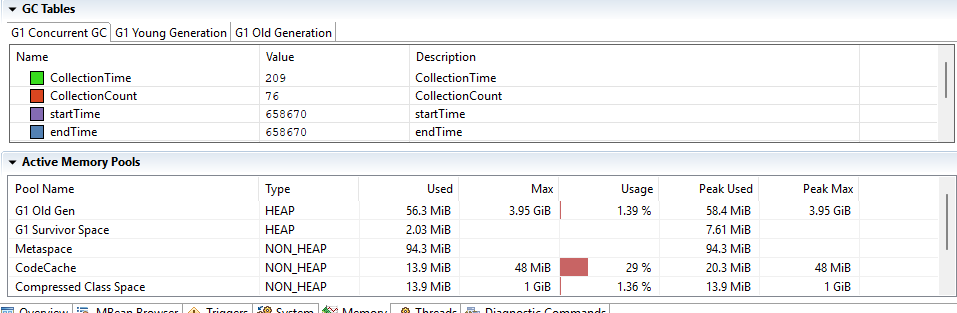

# TrackerBoost – Performance Audit Report: Part 1
## Performance Profiling & JVM Analysis

**Project Title**: TrackerBoost – Optimizing the NovaTech Project Tracker System  
**Date**: June 27, 2025

---

## 1. Introduction
This report details the initial phase of the "TrackerBoost" project, focusing on performance profiling and JVM analysis of the NovaTech Project Tracker system. With increased user load and the implementation of advanced features, performance concerns have emerged, including:
- Slow API responses
- Memory spikes
- Garbage collection pauses

**Objective**: Systematically identify performance bottlenecks within the application's API and JVM to guide optimization efforts.

**Tools Used**:
- JMeter (load testing)
- JProfiler/VisualVM/JMC (profiling)

---

## 2. Load Testing with JMeter
Load testing provides empirical data on response times, throughput, and error rates under simulated user concurrency.

### Test Plan Overview
Focused on key read/write operations representing typical workflows:
1. `GET /projects` - Retrieve all projects
2. `POST /tasks` - Create new task
3. `GET /users/{id}/tasks` - Get user-specific tasks

**Test Configuration**:
- Simulated 100 concurrent users
- Sustained load duration

**Before**

### JMeter Summary Report - GET tasks
*(Insert Screenshot of JMeter Summary Report)*

**Key Metrics**:

| Metric               | Value          | Interpretation |
|----------------------|----------------|----------------|
| # Samples           | 10,000         | Solid statistical basis |
| Avg Response Time   | 40 ms          | Excellent responsiveness |
| Min Response Time   | 1 ms           | Optimal cached response |
| Max Response Time   | 375 ms         | Concerning latency spikes |
| Std. Dev.          | 41.40 ms       | High variability |
| Error %            | 0.040%         | High reliability |
| Throughput         | 426.35 req/sec | Strong processing capacity |
| Avg. Bytes         | 1.7 KB         | Efficient payload size |

**Preliminary Conclusion**:  
The endpoint shows robust average performance but exhibits intermittent latency spikes requiring investigation.

---

## 3. Memory & Thread Profiling
Profiling reveals JVM internals including:
- High-CPU methods
- Memory allocation patterns
- Thread contention

### Profiling Setup
- Application run with profiler agent attached
- Concurrent JMeter load test execution

### VisualVM 


### Key Findings
**Memory Allocation Snapshots**:  
*(Insert Screenshot of Memory Allocation View)*
- Identifies "hot allocators" causing object churn
- Helps reduce memory footprint

**Thread Dump Analysis**:  
*(Insert Screenshot of Thread View)*  
Diagnoses:
- Deadlocks (perpetually blocked threads)
- Resource contention (frequent blocked/waiting states)
- CPU-intensive operations


**Hot Methods & CPU Usage**:  
*(Insert Screenshot of Flame Graph)*
- Identifies methods consuming most CPU time
- Primary candidates for optimization

---

## 4. GC Configuration and Analysis
Garbage Collection directly impacts application responsiveness through Stop-The-World (STW) pauses.



### JVM Flags Used
```bash
-Xmx512m -Xms512m          # Fixed heap size
-XX:+UseG1GC              # G1 Garbage Collector
-Xlog:gc*:file=./gc-g1.log # Detailed GC logging
-XX:+HeapDumpOnOutOfMemoryError # Heap dump on OOM